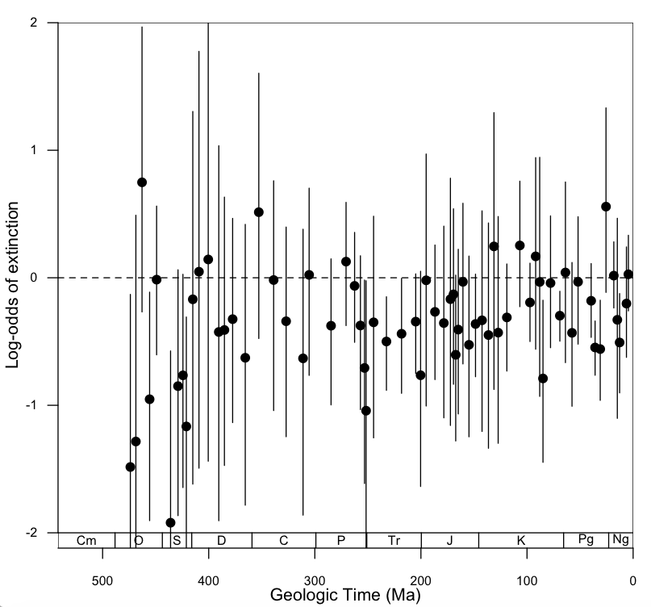

# Logistic Regression

The code below is an example of how to construct a plot time series of extinction selectivity estimated from logistic regression. In this example we will plot size selectivity of extinction for the bivalves.

### This is the plot we are going to make!


````r
## MAKE SURE TO SET YOUR WORKING DIRECTORY!!!

# source() loads a file that contains custom functions
# this particular file only contains two for making a geologic timescales
source("https://github.com/naheim/paleosizePaper/raw/master/sharedCode/functions.r")

# read in size data & timescale
sizeData <- read.delim(file="https://github.com/naheim/paleosizePaper/raw/master/rawDataFiles/bodySizes.txt")
timescale <- read.delim(file="https://github.com/naheim/paleosizePaper/raw/master/rawDataFiles/timescale.txt")
nBins <- nrow(timescale) # a variable of convenience for when the number of stages is used

# for this example plot, we're going to plot the size selectivity of the molluscan class Bivalvia
bivalves <- subset(sizeData, class=='Bivalvia')


# define an empty data frame to hold all the proportions
bivExtSel <- data.frame(matrix(NA, nrow=nBins, ncol=3, dimnames=list(timescale$interval_name, c('coef','ci.minus','ci.plus'))))

# here is our loop to calculate extinction selectivity over time
# this should be very familiar to you by now.
for(i in 1:nBins) {
	temp <- subset(bivalves, fad_age > timescale$age_top[i] & lad_age < timescale$age_bottom[i]) # get all genera alive in interval

	# make sure we have at least 1 bivalve
	if(nrow(temp) > 0) {
		# add a column to temp for extinction
		temp$extinct <- 0 # default give every genus a 0 (=survivor)
		temp$extinct[temp$lad_age >= timescale$age_top[i] & temp$lad_age < timescale$age_bottom[i]] <- 1 # assign a 1 to the victims
		
		# before we do the regression, we want to make sure there are at least 3 survivors & 3 victims
		if(sum(temp$extinct) >= 3 & nrow(temp) >= 6) {
			# run the logistic regression
			myGlm <- glm(extinct ~ log10(max_vol), data=temp, family=binomial)
		
			# assign size coefficient to our output matrix
			bivExtSel$coef[i] <- myGlm$coefficients[2] # the second value is the size coefficient, the first is the intercept
			
			# get the conficence intervals
			myCi <- confint(myGlm)
			
			bivExtSel$ci.minus[i] <- myCi[2,1]
			bivExtSel$ci.plus[i] <- myCi[2,2]
		}
	}
}
````

This is all of the data we want to plot, so let's make a graph using the custom-built ``time.plot()`` function. This function is defined in the 'functions.r' file loaded above. **You can not use this function unless you load *functions.r* first!!**

The ``time.plot()`` function adds a geological timescale to the bottom of your plot. It also removes the 4% buffer that is added to R plots by default. The function takes two main arguments: the range you want your y-axis to span and the y-axis label. For the first argument, we will use a range of 0 to 1, because all our proportions sum to one. The axis label shouldn't need much explanation.

````r
# opens a new plot window with properly scaled and labeled axes
time.plot(c(-2,2), "Log-odds of extinction")

abline(h=0, lty=2) # adding a horizontal line at 0

# the coefficients
points(timescale$age_mid, bivExtSel$coef, pch=16, cex=1.25)

# the error bars
segments(timescale$age_mid,bivExtSel$ci.minus,timescale$age_mid,bivExtSel$ci.plus)
````
