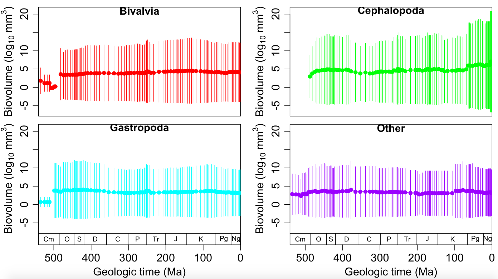

# Multi-panel plot with a timescale
The example code below illustrates how the ``time.plot.mult()`` function that I wrote is used to make a mutliple-panel plot with geologic time as the x-axis. In this example we will plot the mean sizes of different molluscan classes through time.
 

### This is the plot we are going to make!


````r
## MAKE SURE TO SET YOUR WORKING DIRECTORY!!!

# source() loads a file that contains custom functions
# the particular function we are going to use makes a multi-panel plot with a geologic timescale as the x-axis
source("https://github.com/naheim/paleosizePaper/raw/master/sharedCode/functions.r")

# read in size data & timescale
sizeData <- read.delim(file="https://github.com/naheim/paleosizePaper/raw/master/rawDataFiles/bodySizes.txt")
timescale <- read.delim(file="https://github.com/naheim/paleosizePaper/raw/master/rawDataFiles/timescale.txt")
nBins <- nrow(timescale) # a variable of convenience for when the number of stages is used

# for this example plot, we're going to plot the mean sizes of several molluscan classes
mollusca <- subset(sizeData, phylum == 'Mollusca')
````

Hopefully everything up until now makes sense and you are comfortable with reading and subseting data. There are several classes of mollusks. Here we will consider the thre big ones, Bivalvia, Cephalopoda, and Gastropoda, seperately and combine all the other classes into one called 'Other'. 

Here are the next steps now that we've subsetted our data frame to only contain molluscan genera.

1. Make a new factor column that lumps the 'minor' classes.
2. Set up a 3 data frames to hold the calculated mean sizes, lower confidence limits, and upper confidence limits
3. Write a loop that subsets extant genera in each interval, calculates mean size for each class in each interval along with the cooresponding confidence intervals.
	* Inside the loop, we will use ``tapply()`` to calculate the mean for each class.
4. Plot our data.

***Note:*** The ``tapply()`` takes three arguments. 1) the column you want to apply a function to (in our case, the log of biovolume). 2) the column you want has the categories you want to lump your data by (in our case, the four classes). 3) the function you want to use (in our case, ``mean()``).

````r
# make a new column that lumps the minor classes into Other
mollusca$newClass <- as.character(mollusca$class) # makes new column with type 'character'
mollusca$newClass[!is.element(mollusca$newClass, c('Bivalvia','Cephalopoda','Gastropoda'))] <- 'Other' # reset non-big-three classes to Other
mollusca$newClass <- factor(mollusca$newClass) # convert from character to factor

# set up data frames
meanSizes <- data.frame(matrix(NA, nrow=nBins, ncol=4, dimnames=list(timescale$interval_name, levels(mollusca$newClass))))
ciMinus <- meanSizes # since it's empty, we can just re-use it to make our other data frames with the same structure
ciPlus <- meanSizes

# here is our loop to calculate the proportion of each class over time
# this should be very familiar to you by now.
for(i in 1:nBins) {
	temp <- subset(mollusca, fad_age > timescale$age_top[i] & lad_age < timescale$age_bottom[i]) # get all genera alive in interval
	myMeans <- tapply(log10(temp$max_vol), temp$newClass, mean) # calculate the mean for each class
	mySd <- tapply(log10(temp$max_vol), temp$newClass, mean) # calculate the standard deviation for each class (for conf. ints.)
	
	meanSizes[i,] <-  myMeans # add means to data frame
	ciMinus[i,] <- myMeans - 1.96 * mySd # calculate lower confidence level and add to appropriate data frame.
	ciPlus[i,] <- myMeans + 1.96 * mySd # calculate upper confidence level and add to appropriate data frame.
}
````

We will now make our multi-panel plot using ``time.plot.mult()`` and a loop. The ``time.plot.mult()`` function is defined in the 'functions.r' file loaded above. **You can not use this function unless you load *functions.r* first!!**

``time.plot.mult()`` allows you to plot multiple graphs in the same plot window. Each panel will have a the geological timescale as the x-axis, which will only be plotted on the bottome row of panels. The functions arranges panels in a grid and minimally takes two parameters: ``nrow`` and ``ncol``, which define the number rows and columns, respectively, in your grid. After the main function is called, a graph will be plotted each time ``plot()`` is called. It's important to set several parameters in your ``plot()`` command so that the x-axis is supressed--it's already been drawn for you! Make sure the following in included in all of your plot calls: ``xaxt="n", xlab="", xlim=c(541,0)``.

````r
# select colors
myCols <- rainbow(4) # 4 colors from the rainbow

# open the plot window
time.plot.mult(nrow=2, ncol=2) # 4 panels aranged in a 2x2 grid
par(pch=16) # this will make all the plot symbols 
# a loop to plot our data in each indivicual panel
# note how I set ylim
for(i in 1:4) {
	plot(1:10, type="n", xaxt="n", xlab="", xlim=c(541,0), ylim=range(rbind(ciMinus, ciPlus), na.rm=TRUE), ylab=expression(paste("Biovolume (log"[10]," mm"^3,")", sep=""))) # an empty plot
	lines(timescale$age_mid, meanSizes[,i], type="o", col=myCols[i], lwd=1.5)
	segments(timescale$age_mid,ciMinus[,i], timescale$age_mid, ciPlus[,i], col=myCols[i])
	
	text(x=mean(c(541,0)), y=max(ciPlus, na.rm=TRUE), labels=levels(mollusca$newClass)[i], font=2, cex=1.15)
}
````
## Now you have a multi-panel plot!