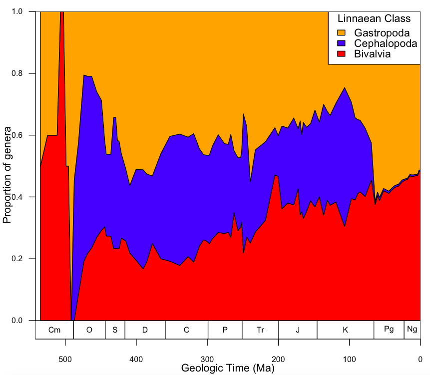

# Molluscan Proportions
## with a nicely formatted time scale

The code below is an example of how to construct a plot of proportional diversity. In this example, the proportions of the three major molluscan classes are plotted. 

I also introduce a custom function that I wrote which plots time series data on a nicely formatted geological timescale. 

### This is the plot we are going to make!


````r
## MAKE SURE TO SET YOUR WORKING DIRECTORY!!!

# source() loads a file that contains custom functions
# this particular file only contains one for making a geologic timescale
source("https://github.com/naheim/paleosizePaper/raw/master/sharedCode/functions.r")

# read in size data & timescale
sizeData <- read.delim(file="https://github.com/naheim/paleosizePaper/raw/master/rawDataFiles/bodySizes.txt")
timescale <- read.delim(file="https://github.com/naheim/paleosizePaper/raw/master/rawDataFiles/timescale.txt")
nBins <- nrow(timescale) # a variable of convenience for when the number of stages is used

# for this example plot, we're going to plot the proportion of the three major molluscan classes
mollusca <- subset(sizeData, is.element(class, c('Bivalvia','Cephalopoda','Gastropoda')))
````

Hopefully everything up until now makes sense and you are comfortable with reading and subseting data. However, one of the things that you need to also get used to doing is understanding and working with factors. Factors are a data type that is essentially a set of categories. In our case the factor we are working with is class name. By default, R reads in non-numeric and non-logical fields as factors (rather than strings/characters). 

One of the quirks of R, is that when you subset a data frame, all the levels (i.e., different categories) are retained after subsetting. Type ``table(mollusca$class)`` to see what I mean--all the classes are present, though only three have any values.

Here is a trick to get rid of the factor levels that no longer exist in the dataset--we're resetting the levels. Note that re-running the table function only produces counts for the levels that actually exist in our data frame.

````r
# reset the factors
mollusca$class <- factor(mollusca$class) 
table(mollusca$class)

# define an empty data frame to hold all the proportions
mollProp <- data.frame(matrix(NA, nrow=nBins, ncol=3, dimnames=list(timescale$interval_name, levels(mollusca$class))))

# here is our loop to calculate the proportion of each class over time
# this should be very familiar to you by now.
for(i in 1:nBins) {
	temp <- subset(mollusca, fad_age > timescale$age_top[i] & lad_age < timescale$age_bottom[i]) # get all genera alive in interval
	classCounts <- table(temp$class) # count the number of those genera in each category
	classProp <- classCounts/sum(classCounts) # calculate the proportions
	mollProp[i,] <- classProp # assign proportions to our data.frame
}
````

To plot the proportional diversty of the three molluscal classes, we will use the ``polygon()`` function. This function takes vectors of x-values and y-values as arguments. 

Conceptualize the polygon we'll plot as a two lines that define the upper and lower bounds of the indivicual regions. Consider, for example the red region on the figure above. To make that red region, you will plot the bottom line first, then the top line, but in reverse order. Imagine drawing your finger along the bottom of the red region (note all the values are 0), then moving your finger up the right-side axis until you get to the top of the red region, then tracing your finger back to the left. This is the order in which we will plot the "points" that define the polygons: you will plot the points on the bottom from left to right, then the points of the top line from right to left. You will do this three times, once for each class. 

The x-values will actually be the same for every polygon, so we only need to make one vector. Make sure you understand how this is constructed and why it's put together the way it is.  Use ``?rev`` if you need!

````r
# the vector of x-values 
xPoly <- c(timescale$age_mid, rev(timescale$age_mid)) 

# Now we need to make vectors for the y-values in an analogous way.
# Make sure you understand how this is constructed and why it's put together the way it is.  Use ?rep if you need!
yPoly1 <- c(rep(0, nBins), rev(mollProp[,"Bivalvia"])) # why are we using rep(0, nBins)?
yPoly2 <- c(mollProp[,"Bivalvia"], rev(mollProp[,"Bivalvia"] + mollProp[,"Cephalopoda"]))
yPoly3 <- c(mollProp[,"Bivalvia"] + mollProp[,"Cephalopoda"], rev(mollProp[,"Bivalvia"] + mollProp[,"Cephalopoda"] + mollProp[,"Gastropoda"])) # why are we using rep(0, nBins)?
````

Now that you have all the vectors you need, let's introduce the custom-build ``time.plot()`` function. This function is defined in the 'functions.r' file loaded above. **You can not use this function unless you load *functions.r* first!!**

The ``time.plot()`` function adds a geological timescale to the bottom of your plot. It also removes the 4% buffer that is added to R plots by default. The function takes two main arguments: the range you want your y-axis to span and the y-axis label. For the first argument, we will use a range of 0 to 1, because all our proportions sum to one. The axis label shouldn't need much explanation.

````r
classCols <- c("red","blue","orange") # colors for the plot regions, 1 for each class

# opens a new plot window with properly scaled and labeled axes
time.plot(c(0,1), "Proportion of genera")

# add the polygons to the plot
polygon(xPoly, yPoly1, col=classCols[1])
polygon(xPoly, yPoly2, col=classCols[2])
polygon(xPoly, yPoly3, col=classCols[3])

# add a legend
legend("topright", legend=rev(levels(mollusca$class)), fill=rev(classCols), bg="white", title="Linnaean Class") # I use rev() here so the classes are listed on the legend in the same order they appear in on the plot.
````
